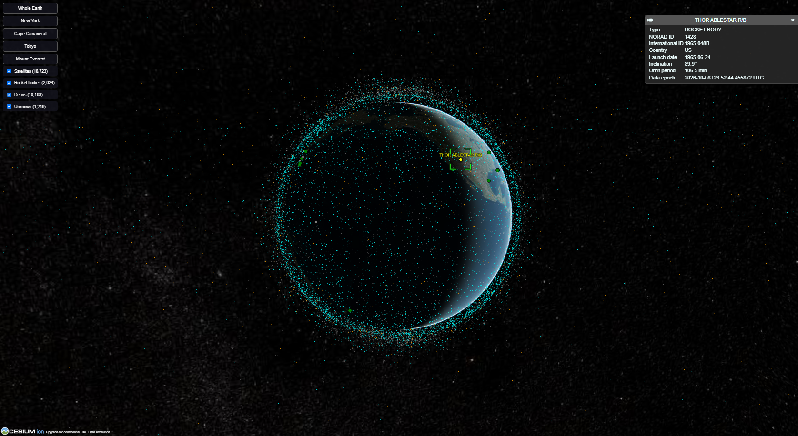

# Globe Tracker

A 3D globe that shows more than 32,000 satellites, rocket bodies and pieces of space debris moving in real time, plus upcoming and recent rocket launches. Aircraft and ships are coming next.

Built with JavaScript, Vite and CesiumJS as a learn-by-building project.



## Features

- **32,000+ orbital objects** from Space-Track, with CelesTrak as an automatic backup if Space-Track is unavailable
- **Live positions** calculated in the browser from orbital data (SGP4 via satellite.js), updated every frame
- **Filters** to show or hide satellites, rocket bodies, debris and unknown objects
- **Hover** a satellite to see its name, **click** it for details (type, country, launch date, inclination, orbit period)
- **Launch pads** for upcoming and recent launches from Launch Library 2. Green pads have a launch coming up; click one for its schedule
- **Camera locked** to orbit around Earth, with fly-to buttons for a few places

## Tech stack

- **JavaScript** (ES modules, no framework)
- **[Vite](https://vite.dev/)**: dev server and build tool
- **[CesiumJS](https://cesium.com/platform/cesiumjs/)**: 3D globe and rendering
- **[satellite.js](https://github.com/shashwatak/satellite-js)**: orbit calculations (SGP4)
- **Node.js scripts**: download and prepare the data

## Data sources

- **[Space-Track.org](https://www.space-track.org/)**: orbital data for the full public catalog (free account required)
- **[CelesTrak](https://celestrak.org/)**: backup source for orbital data
- **[Launch Library 2](https://thespacedevs.com/llapi)** by The Space Devs: launch schedules and launch pads
- **[Cesium ion](https://cesium.com/platform/cesium-ion/)**: satellite imagery and 3D terrain

The data files are not included in this repository. You create them by running the fetch scripts below. Space-Track's terms do not allow redistributing its data, so `public/data/` is listed in `.gitignore`.

## Running it locally

You need:

- [Node.js](https://nodejs.org/) 22 or newer
- A free [Cesium ion](https://cesium.com/ion) account (for the access token)
- A free [Space-Track](https://www.space-track.org/auth/createAccount) account (optional; without it the app uses CelesTrak)

1. Clone the repository and install dependencies:

```bash
   git clone https://github.com/Malek-art-05/globe-tracker.git
   cd globe-tracker
   npm install
```

2. Create a file named `.env` in the project root:

```
   VITE_CESIUM_ION_TOKEN=your-cesium-ion-token
   SPACETRACK_USER=your-space-track-email
   SPACETRACK_PASS=your-space-track-password
```

   `.env` is listed in `.gitignore`, so it is never committed. Only variables starting with `VITE_` are sent to the browser; the Space-Track login stays on your computer.

3. Download the data:

```bash
   npm run fetch:satellites
   npm run fetch:launches
```

   Both scripts skip the download if the data was fetched recently, to respect the providers' rate limits (Space-Track: once every 2 hours, Launch Library 2: once per hour).

4. Start the dev server:

```bash
   npm run dev
```

5. Open http://localhost:5173

## How it works

Fetching data and showing it are kept separate:

1. **Fetch scripts** (Node.js) log in to the data providers, download the data,

## What I learned

- Rendering tens of thousands of moving objects smoothly by batching them into one primitive and spreading the work across frames
- Calculating satellite positions from orbital elements with SGP4
- Keeping credentials out of the browser by fetching data on the server side
- Working within API rate limits and terms of use, with caching and a fallback data source
- Structuring a project so the same code can later run on AWS